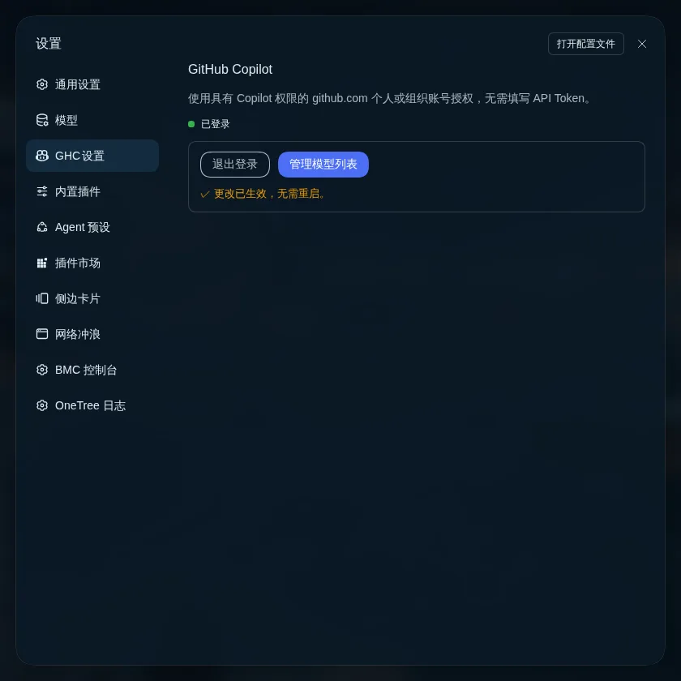
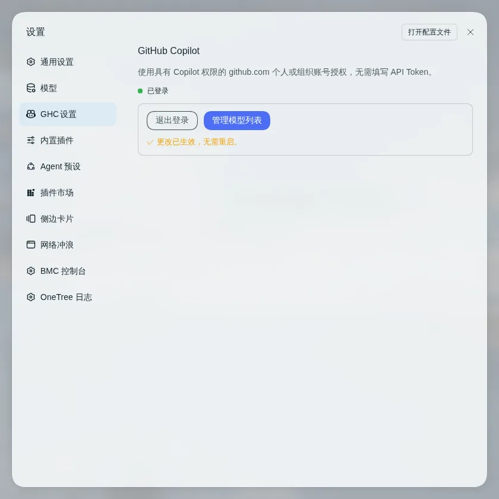
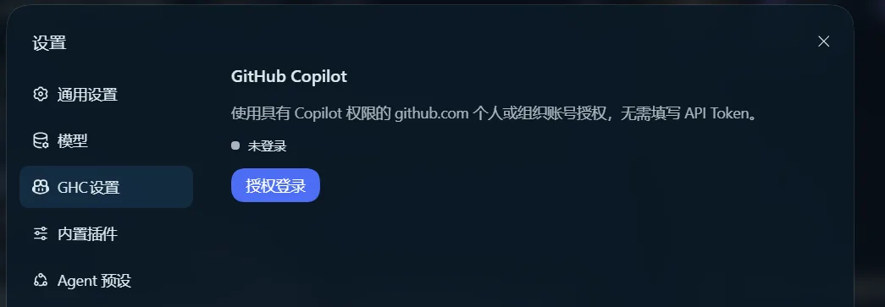
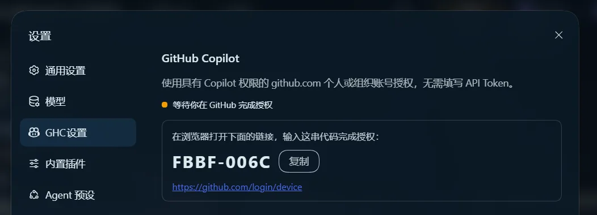
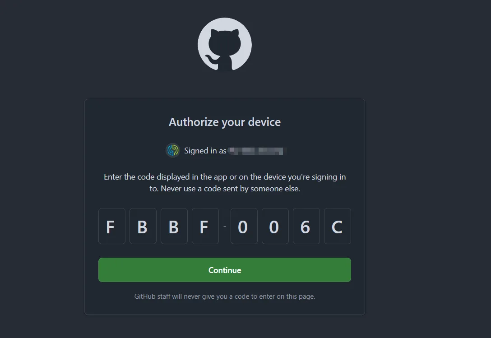
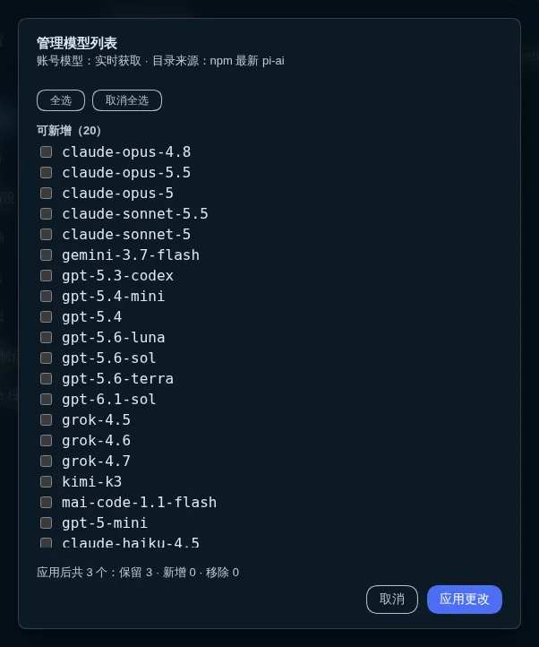
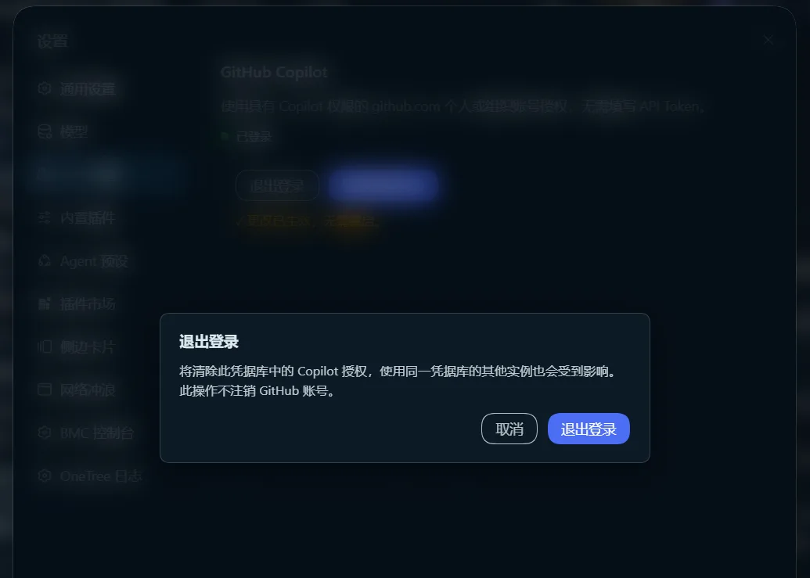

# @inventec/dsh-copilot-auth

[](https://github.com/iasiv5/dsh-copilot-auth/releases)
[](https://www.npmjs.com/package/@inventec/dsh-copilot-auth)
[](https://github.com/iasiv5/dsh-copilot-auth/actions/workflows/ci.yml)
[](https://github.com/iasiv5/dsh-copilot-auth/blob/main/LICENSE)
[](#版本兼容)

为 DSH（DeepSeek Harness）内置的 GitHub Copilot 通道补上**网页设备码登录 / 注销**入口，预置开箱即用的 Copilot 提供方路由，并提供**模型列表管理**。用公司 GitHub 账号（带 Copilot 订阅）登录 DSH 的方式与其他 Copilot 客户端一致：**网页 + 设备码**，全程不填 API Token。

插件**复用 DSH 内置通道**（pi-ai 的 github-copilot provider），不实现任何 GitHub 协议代码——token 自动轮换、模型发现、协议适配全部由内置实现负责，插件只做设置页、预置路由与目录管理。

| 深色 | 浅色 |
|---|---|
|  |  |

## 30 秒上手

本节回答：怎么装上、怎么登录。

```sh
dsh plugin --profile web add @inventec/dsh-copilot-auth
```

1. 重启 DSH Web 并刷新页面。
2. 打开 设置 → **GHC设置**（英文界面为 *GHC Settings*，位于 Models 之后），点「**授权登录**」。
3. 在 `https://github.com/login/device` 输入页面显示的设备码（可一键复制）完成授权；**SSO 组织账号必须对组织点 Authorize**，跳过则登录不生效。
4. 回到设置页看到「已登录」：首次登录自动填充模型目录，到 Models 页选择 `GitHub Copilot` 路由即可使用。

固定版本 / 更新 / 卸载：

```sh
dsh plugin --profile web add @inventec/dsh-copilot-auth@1.2.20   # 固定版本（可复现安装）
dsh plugin --profile web update @inventec/dsh-copilot-auth       # 更新
dsh plugin --profile web remove @inventec/dsh-copilot-auth       # 卸载
```

> 企业镜像 / 私有源下 pnpm 解析 peer 失败：`export npm_config_auto_install_peers=false` 后重试（profile 自带的 pnpm workspace 默认已关闭 peer 自动安装）。registry 的 `latest` dist-tag 可能落后于 `next`，按版本号排查时勿被 `latest` 误导。

登录流程实拍（未登录入口 → 设备码 → GitHub 授权页）：

| | |
|---|---|
|  |  |



## 功能一览

| 能力 | 说明 |
|---|---|
| 🔐 设备码登录 / 注销 | 网页 + user code，免 API Token；SSO 组织授权友好。凭据存入 DSH 内置凭据库（文件强制 0600），Copilot 临时 token 到期自动刷新 |
| 🧩 预置提供方路由 | 安装即在 Models 页出现 `GitHub Copilot` 路由，无需手动「添加模型」 |
| 📦 模型目录兜底 | 首次登录自动写入账号全部可用模型；你已精简 / 定制过的目录**永不覆盖**（重启、重新登录均不重置） |
| 🎛️ 管理模型列表 | 目标状态编辑：勾选即终态，支持新增、移除、挽留与「对齐账号与目录」（见下节） |
| 🌐 中 / 英双语 | 跟随 DSH 语言设置自动切换 |
| 🧪 测试与 CI | 210 条单元测试（ubuntu / windows / macos 三平台矩阵）；tag 触发 npm Trusted Publishing 发布（provenance） |

## 管理模型列表

pi-ai 的模型目录是打包时硬编码的 JSON：上游新增模型在本机无法解析。GHC 设置页的「**管理模型列表**」（登录后可见）在不升级 pi-ai 的前提下解决目录过期，并补上局部删除能力：



- **勾选即终态**：一张分组全表——**可新增**（账号可用 ∩ 目录可解析，默认不勾）、**在列**（默认勾选）、**待删除候选**（在列但账号未报告 / 目录无法解析，默认不勾＝删除提案，重新勾选即**挽留**）。应用时被保留模型的对象、顺序与定制逐字保留，被移除模型的定制随模型消失。
- **快捷动作**：「全选 / 取消全选」作用于全表；「**对齐账号与目录**」仅在漂移时出现，一键把勾选态设为账号 ∩ 可解析；「**同时清除全部模型定制**」复选框仅在存在可清除定制时出现；摘要行常驻显示「应用后共 N 个：保留 · 新增 · 移除」。
- **证据门控按实际 diff**：纯新增可用 24 小时内同授权的缓存；**移除类变更强制实时账号证据 + 最新目录并二次确认**（缓存下勾选删除会自动升级为实时预览）；空目标需单独确认，落显式空列表且不会被登录自动回填。
- **生效时机**：web / 服务形态先做原子只增补丁、**重启后**生效；desktop（只读 `app.asar`）走进程内注册表注入，**当次生效、无需重启**、不碰官方产物（ADR 0003）。
- **并发与恢复**：每个操作带服务端签发的 operationId（幂等可查、绝不重复执行）；配置并发编辑永远优先（漂移返回 409 要求重新预览）；崩溃 / 重启后可恢复，出现冲突时提供「结束旧配置意图」显式闭环。

## 工作原理

- 通过 `cordis.patch.yml` 两段生效：挂载本插件 entry（host 侧在 webserver 上开 7 条 `/copilot-auth/*` 本地路由，跨站 Origin 拒绝；模型路由要求 `protocolVersion: 3`），并以 settings base 层预置 `github-copilot` 路由（用户 `settings.yaml` 可逐字段覆盖）
- authorization 服务 **0.1.7+ 由 runtime 内置**，插件不再挂载（≤0.1.5 请用 v1.1.x，见「版本兼容」）
- 登录走 GitHub 设备码流；授权生命周期有单实例 attempt、15 分钟等待上限与超时风险锁存，超时后晚到的授权成功只更新事实、不再写配置
- 模型目录兜底只在「尚不存在」时由登录成功写入一次，填充后归用户所有；同步失败经 `/copilot-auth/status` 的 `syncError` 暴露
- 刷新状态按 profile 隔离存于 `<profile>/copilot-auth/`；目录数据从 npm 拉取最新 pi-ai tarball（强制 integrity 校验），失败回退本地目录，可**显式**改用内置覆盖层，绝不隐式降级

## 版本兼容

| 插件线 | DSH 实测版本 | 说明 |
|---|---|---|
| **v1.2.x** | `0.1.7-rc.2` ～ `0.2.0-rc.2` | 当前线；`0.2.0` 起注意插件 peer 精确版本守卫 |
| v1.1.x | `0.1.2-rc.1` ～ `0.1.5-rc.2` | 旧版线；依赖 v1.2.0 已移除的 authorization 挂载补丁，新版 DSH 上无法激活 |

逐版本沿革（v1.2.0 ～ v1.2.20 完整说明与已移除能力的语义记录）见 [docs/CHANGELOG.md](./docs/CHANGELOG.md) 与 [GitHub Releases](https://github.com/iasiv5/dsh-copilot-auth/releases)。

## FAQ

**需要填 GitHub API Token 吗？**
不需要。登录走标准设备码流，凭据由 DSH 内置凭据库托管（0600），插件不接触、不存储任何 Token。

**点「授权登录」后一直等待，或显示超时？**
等待有 15 分钟本地时限。超时后显示「结果待核实」：此时不能再发起新的授权尝试，请点「查询状态」或人工核实；若确认未授权，重启 DSH Web 后即可重试（风险锁存随进程结束清空）。

**SSO 账号登录后没生效？**
GitHub 授权页上必须对组织点 **Authorize**，跳过该步登录不生效。

**怎么退出登录 / 换账号？**
GHC 设置页「退出登录」：确认弹窗 → 清除凭据 → 删后核实。它会清除同一凭据库中所有实例共享的 Copilot 授权，但**不注销 GitHub 账号**。换号 = 先退出再登录；授权进行中或超时未核实期间退出会被拒绝（如实提示）。



**「请求撤回」按钮去哪了？**
已移除（Q38）：它无法真正撤销 GitHub 侧设备流，其风险锁存反而造成「登录成功却不能退出」死局。误启动的等待由 15 分钟超时自然收敛。详见 [docs/CHANGELOG.md](./docs/CHANGELOG.md)。

**账号新出的模型没出现？**
目录只在首次登录兜底填充一次，之后归你所有。用 GHC 设置页「管理模型列表」勾选加入，或在 Models 页手动添加。

**premium 配额怎么算？**
base 模型（GPT-4o / 4.1 一类）不耗 premium requests；premium 模型（Claude、Gemini、o 系列等）每次调用消耗月度配额。日常建议 base 档，premium 按需手动选。

**dsh-desktop（Electron）支持吗？**
支持（v1.2.5 起）：只读 `app.asar` 形态下模型刷新走进程内注册表注入，当次生效、无需重启；上游改动注册表形状时守卫会拦截并报 `registry-*` 结构化错误，模型列表保持原样（不写 settings）。

**Models 页的状态圆点显示未配置？**
圆点只反映 API Key 引用，OAuth 登录成功后仍可能显示未配置——外观问题，功能不受影响。

## 已知边界

- 自行 patch `llm-pi-ai` 整段 config 会覆盖预置路由；`settings.yaml` 的 `llm-pi-ai:` 节只能稀疏覆盖字段，无法删除预置路由本身（移除须卸载本插件）
- 路由前缀 `/copilot-auth` 两侧硬编码，不可配置
- 模型目录「**只增不更新**」：合并只补充本机从未见过的条目，上游对已有 id 的元数据修正不会同步（ADR 0001）
- DSH rc 版本耦合：实测 `0.1.7-rc.2` 与 `0.2.0-rc.1 / rc.2`，peer 仅 `@deepseek-ai/cordis@^4.0.2`
- DSH 升级后的目录自愈仅在 pi-ai 基线版本不变时按已确认条目只增重放；跨基线且条目缺失时上报 `self-heal-incompatible`，不修改安装树（重新执行一次手动刷新即可在新基线上激活）
- 并发保护为宿主单进程内 mutex，不支持多实例 / 多进程并发操作同一安装目录
- 目录 fsync 仅在 POSIX 执行：Windows 无目录 fsync 语义（必然 `EPERM`），直接跳过，一致性由 NTFS 元数据日志保证（v1.2.3 起）
- 等待超时后，该 profile 的旧预览与待生效配置意图按代次失效，须重新预览或显式「结束旧配置意图」

## 开发

```bash
npm install
npm test        # node:test：210 条（CI 跑 ubuntu/windows/macos 三平台矩阵）
npm run build   # esbuild 打包 client 到 lib/client.js（__ModuleLoader__ 信封）
npm pack --dry-run
npm run capture # 截取 README 预览图（需本机 DSH 实例；详见脚本头注）
```

| 路径 | 职责 |
|---|---|
| `cordis.patch.yml` | 两段 patch（本插件 entry / 预置路由） |
| `src/host.mjs` · `src/shared.mjs` | host 半区：路由接线、status 聚合、启动期能力探测 |
| `src/auth-host.mjs` · `src/auth-flow.mjs` | 授权控制器（单实例尝试、超时风险锁存、首次填充 handoff）与客户端状态机 |
| `src/runtime-scope.mjs` | 稳定 profile 身份与私有 dataDir（`<profile>/copilot-auth/`） |
| `src/refresh-service.mjs` · `src/refresh-transaction.mjs` · `src/model-update.mjs` | 预览快照 / 证据门禁 / 幂等 · 事务内核与恢复 · 纯变更策略 |
| `src/catalog.mjs` · `src/catalog-fetch.mjs` · `src/catalog-registry.mjs` | 目录解析 / npm 拉取 · 只读安装树的进程内注入通道（ADR 0003） |
| `src/client.jsx` · `lib/client.js` | client 半区：设置页 UI（双语）与构建产物（入库，git 安装免构建） |

从源码安装：`dsh plugin --profile web add /path/to/dsh-copilot-auth`

设计决策与评审记录见 [docs/adr/](./docs/adr/) 与 [docs/plans/](./docs/plans/)。

## 维护者发布

本项目使用 npm **Trusted Publishing（GitHub Actions OIDC）** 发布，不在仓库或 GitHub Secrets 中保存 `NPM_TOKEN`：推送 `v*` tag 或手动触发 [`.github/workflows/release.yml`](./.github/workflows/release.yml)，workflow 以 `id-token: write` 运行，npm 自动使用 OIDC 并生成 provenance。Trusted Publisher 按 package 配置（owner `iasiv5`，repository `dsh-copilot-auth`，workflow `release.yml`）；首次发布前需在 npm 侧完成一次性 bootstrap，详见 [npm Trusted Publishing 文档](https://docs.npmjs.com/trusted-publishers)。

## 风险与合规

通道为社区通用路线（基于 pi-ai 内部实现），**非 GitHub 官方支持 API**，可能随服务端变更失效；GitHub AUP 禁止批量自动化滥用，**公司账号请正常强度使用**。

## License

[MIT](./LICENSE)
